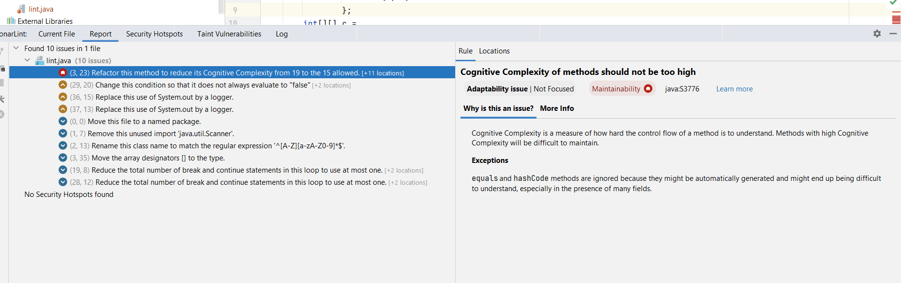

## Отчет по линтеру
---

Код программы  записан  [тут ](lint.java)

 Можно посмотреть на скрине рекомендации данные линтером 

В общем рекомендации таковы:
- оптимизировать условные запросы, 
- не выводить вывод на консоль, а записывать в лог-файл,
- убрать неиспользуемый импорт,
- улучшить структуру хранения файлов,
- убедиться, что условия в некоторых местах выполнимы
